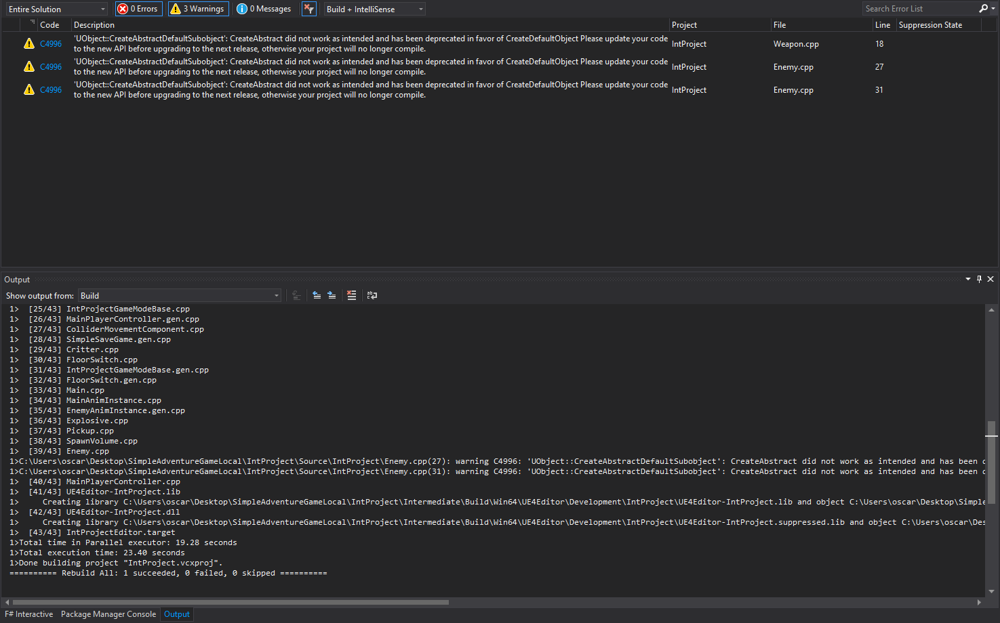

# Integration Project

This program is focused on showing the software developement skills I learned from Programming II in a game environment.

Full Project Folder Link:  
https://eaglefgcu-my.sharepoint.com/:f:/g/personal/oefox0055_eagle_fgcu_edu/EvR0dCedU_9Nk5RFiD_YsJMBc0AuqsNE1sUQU7ZyIuWx8A?e=6sceHY

## Documentation
Unreal Engine Docs:  
https://docs.unrealengine.com/4.27/en-US/  

Project Docs:  
https://oscarfox3.github.io/SimpleAdventureGame/html/  

## Demonstrate
It is my intention to demonstrate the OOP skills that are involved in a successful project.  

## Style and Structure
Unreal Engine Programming Reference:  
https://docs.unrealengine.com/4.27/en-US/API/

## Quality and Security
Unreal Engine Coding Standard:  
https://docs.unrealengine.com/4.27/en-US/ProductionPipelines/DevelopmentSetup/CodingStandard/

## Software

Microsoft Visual Studio IDE:  
https://visualstudio.microsoft.com/vs/community/

Unreal Engine:  
https://www.unrealengine.com/en-US/download

## Resources

Tutorial series for learning C++ with Unreal Engine by Stephen Ulibarri:  
https://www.udemy.com/course/unreal-engine-the-ultimate-game-developer-course

Assets:  
https://github.com/DruidMech/LearnCPPForUnrealEngineUnit2
